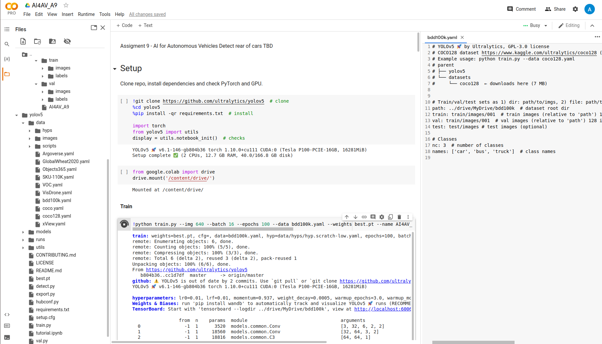
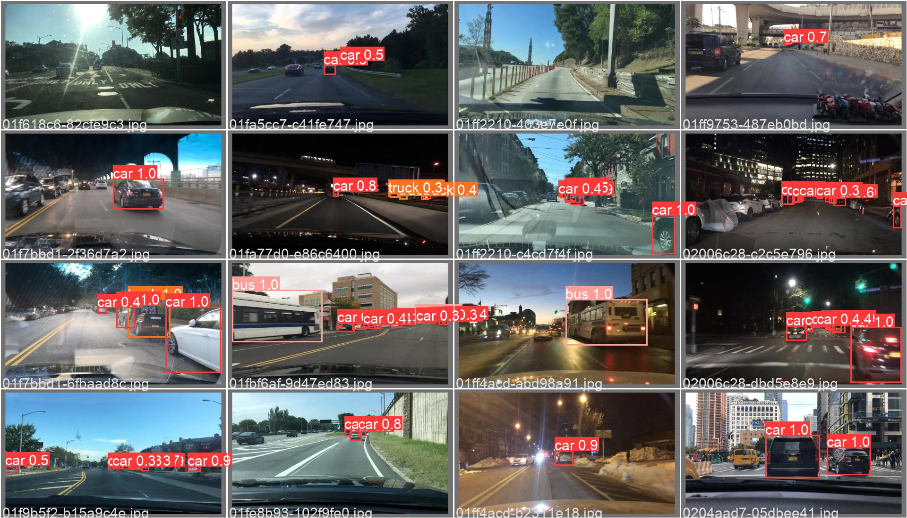
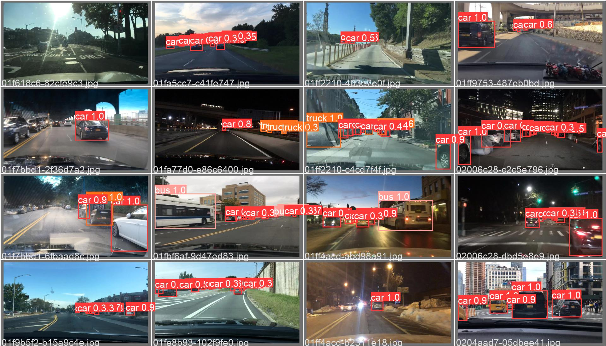

# Rear vehicle detector using YOLOV5 and BDD100k

Maria Angelica Taylor 
AI for Autonomous Vehicles WPI. 
Assigment 9

Safe driving requires continuously resolving a long tail of those corner cases. The only possible way to learn a robust driving policy model is to continuously capture as many of these cases as possible. In this project, we would build a rear vehicle detector function that computes bounding boxes around each clearly visible vehicle on front. The detector should be looking for vehicle(s) 
in front of the camera which are also driving in the same direction. The purpose of this task is to improve the Forward Vehicle Collision Warning feature, which requires a very accurate bounding box around the rear side of the vehicle(s) ahead. 

Data set = BDD100K data set - Download available at: https://bdd-data.berkeley.edu/

Goal = Build a rear vehicle detector - of cars driving in the same direction. 

Classes to detect: Cars, Buses and Trucks.

Method = Transfer learning from YOLOV5. This pre trained weights already detects cars, buses and trucks. However it does not discriminate between front and rear. 

Plataform = COLAB

Location of project: https://drive.google.com/drive/folders/1jFc2SKXuAHEXBElpq68asIs0gjtRl9xw?usp=sharing

## Local folder structure : 

1. Download data set in your local machine
2. Make a folder named bbdd100k, inside made four folders: test, train, val, utils. Inside train and val create two folders images and labels. 

```html
mkdir bbd100k
cd bbd100k
mkdir test
mkdir train
mkdir val
mkdir utils
cd train
mkdir images
mkdir labels
cd ..
cd val
mkdir images
mkdir labels
```
Move the downloaded images on the train/images, val/images and test folder. In the utils folder download the files in this repo. 

### Create labels 

This step is super important since the labels for the dataset does not descriminate if it is the rear or the front of the car, therefore we need to pre process the labels to achive the desired performance. 

If the image have the label yellow line, this means that cars in both directions are driving in both directions and we need do not want to label the ones driving in the opposite direction. In this care we only care about the labels that there bounding box is present in the 2/3 right portion of the frame. Note that the 2/3 estimation is an empirical estmation that worked favorable in this dataset. 

If there is not a yellow line in the frame, we assume that the frame have with lines that means there is cars drivng in the same direction only. In this case, we take into account all the labels for car, bus and truck present in the image. 

In [1], they use the file label_to_txt.py to create the labels for image in the YOLO format. This script captures all the labels that have a bouding box in the images ex. bikes, trafict lights, motorcicles. For the purpose of this task, we only care about cars, truck and bus labels, thefore we modified in label_to_txt_yellow_line.py. This script check if there is a yellow line, if there is only read the labels from the json file that are in the 2/3 right of the frame, if there isnt it will read all the labels corresponding to car, bus or truck. 

To run this label filter script we run from the utils folder there this script is:

```html
python label_to_txt_yellow_line.py -l ~/PATH_TO_DATA/bdd100k/train/bdd100k_labels_images_train.json -d ~/PATH_TO_DATA/bdd100k/train/labels

python label_to_txt_yellow_line.py -l ~/PATH_TO_DATA/bdd100k/val/bdd100k_labels_images_val.json -d ~/PATH_TO_DATA/bdd100k/val/labels
```

After we use the script rm_imgs_without_labels.py to check to remove the training image if not label information present. This situation is present when no labels for those frames were present in the json file. 

```html
python rm_imgs_without_labels.py -d ~/bdd100k/train/images -l ~/PATH_TO_DATA/bdd100k/train/labels
python rm_imgs_without_labels.py -d ~/bdd100k/val/images -l ~/PATH_TO_DATA/bdd100k/val/labels
```

#### Separarte labels and images into different folders to train in colab - optional, depends on good drive storage availability. 

```html
python split_training.py -l ~/bdd100k/train/images -n 20000
python split_training.py -l ~/bdd100k/train/labels -n 20000
```
## COLAB set up
Create a folder in your drive named bdd100k, inside create folders train, test, val. Inside train and val create a folder named images and labels. 

Ex. tranfer the 001 folder of images and labels of train and val in the respective folders. See my drive to check the folder structure. 

Copy the notebook AI4_AV.ipyn notebook into drive. Follow the notebook:

1. Download YOLO
2. Mount your drive 
3. Copy the weights best.pt inside the yolov5 folder (first time training- use yoloc5s.pt)
4. Copy the file bdd100k.yalm into the data folder (/001 for first time but you can train in different sets)
5. Train

COLAB folder should look like:


```html
!python train.py --img 640 --batch 16 --epochs 100 --data bdd100k.yaml --weights yolov5s.pt --name AI4AV_results --cache --project '../drive/MyDrive/bdd100k' --name 'backup'
```
This will create a backup folder that will save the best and last weights, and some metrics files. 

Each training set download the best.pt weights form the backup folder to train on the next set of images.

If you dont want to train and only validate, copy the best weights of this repo into yolo main folder and tested as: !python val.py --weights best.pt --data bdd100k.yaml --img 640 --iou 0.65 --half

You can also use detect on your test set using this code:
!python detect.py --classes 3 --weights best.pt --data data/bdd100k.yaml --img 640 --conf 0.25 --source ../drive/MyDrive/bdd100k/test/images --save-txt

Test and Enjoy!

Other attemps: 

First I tried to filter all the labels to take into account only the right half of the image, however training the first batch the network was bias and will ignore the vehicles in the left if they are in the same direction as shown as follows:



Then, I filter labels such that if there is a yellow line consider the vehicles in the right side of the frame, this was working good when the cars where in the same direction, but not when there was a yellow line, because it was misisng cars in front. Per example if the vehicle is riding at the right of a two lane road, the camera may see it in the left side and ignore it. As shown bellow: 



References: 

[1] BDD100K using YOLO V3: https://github.com/yogeshgajjar/BDD100k-YOLOV3-tiny

[2] YOLOV5: https://github.com/ultralytics/yolov5